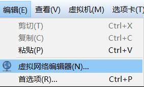

# ubuntu server 20.04LTS NAT模式配置静态IP

## 查看vmnet8分配到的IP

Win+R打开运行，打开cmd，输入`ipconfig -all`

找到下图部分：

记录IPv4地址：`192.168.32.1`(人人不同，以自己的为准)，后面将用到。

## 设置VMware虚拟网络编辑器

### 打开VMware菜单栏编辑->虚拟网络编辑器

按下图设置

其中子网IP前三段与上面第二步记录的IPv4IP相同，最后一位为0，表示网络段。 然后打开NAT设置：

依然前三段相同，最后一段为2，网关常用设置。

确定后暂时勾选下列选项，并打开DHCP设置，查看可用IP段：记录ip地址的起始和结束 记录起始IP地址和结束IP地址，关闭DHCP设置，取消勾选"使用本地DHCP服务将IP地址分配给虚拟机(D)

# Ubuntu Server配置静态IP

由于ubuntu版本不同，netplan文件不同，所以使用下列命令查看自己的文件名：
`ls /etc/netplan`
我的是`01-network-manager-all.yaml`
所以`vi /etc/netplan/01-network-manager-all.yaml`
编辑如下： [配置文件](config.yml)
然后修改hosts：`sudo vim /etc/hosts`
主机名前填自己的IP即可。

# 验证配置是否有问题

`netplan apply`

# 重启应用更改

`reboot`
`ping www.baidu.com`